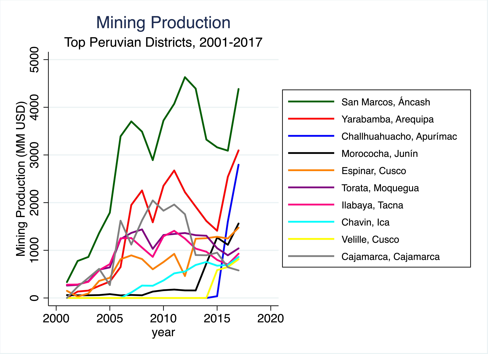

# Mines_2001-2017

Author: Sebastian Sardon

Programs that download spreadsheets from the Ministry of Energy and Mines (MINEM) and use them to build a panel dataset of Peruvian districts' mining production.

Instructions:\
    Step 1. Retrieve raw data from MINEM's official webpage using the program "Scrape MINEM.py" [requires Python] \
    Step 2. Clean raw data using the program "Clean MINEM.do" [requires Stata]

Output dataset available [here](https://www.dropbox.com/sh/qnof8t49l1l51h1/AAB_4-XEjIYbd_DAn37zfQDVa?dl=0).

The following figures can be replicated with the dataset:

  
   
   

